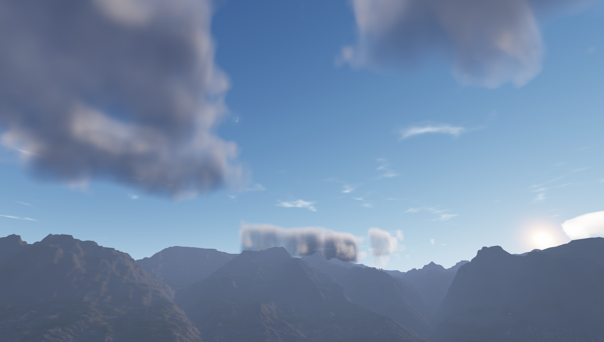

# Horizon Weather & Time ☁️

> ⚠️ **WIP / HEAVY ALPHA:** This system is currently in early, active development. Features are highly experimental, and the architecture may shift as things evolve. Expect bugs, but also expect rapid improvements!

**A feature-rich environment, weather, and time-of-day system for Unity & VRChat.**

Horizon is designed to look beautiful **out-of-the-box** while offering deep customization. Whether you need a simple day/night cycle or a complex, directed weather transition, Horizon provides a complete toolset for your scene's atmosphere.

---

## 📋 Requirements

The system is being developed and tested on the latest versions that were relevant during development. Older versions may work but are not guaranteed.

- **Unity:** 2022.3.22f1
- **VRChat SDK:** Worlds 3.10.2+

---

## ⚡ Core Features

- **Accurate Day & Night Cycles:** Sync your world to real-world timezones, and set physical **Latitude** and **Axial Tilt** to accurately simulate celestial trajectories, seasons, and true day/night lengths based on geographical location.
- **Modular Weather States:** Easily mix and match weather conditions using reusable Profiles. You can smoothly transition the entire global weather, or independently override specific layers (like rolling in storm clouds while keeping the sun shining).
- **Procedural Atmospherics:** A custom, optimized skybox shader that attempts to replicate real atmospheric phenomena. Includes Rayleigh & Mie scattering, physically-based Sun and Moon rendering, realistic starry skies, and raymarched volumetric clouds.
- **Smart Dynamic Particles:** The weather particle system follows the player while automatically respecting roofs and overhangs using **depth-based occlusion**. Zero manual setup required — no more placing "dry zone" triggers by hand. Your interiors stay dry automatically.
- **Built-in Generation Tools:** Includes Editor tools to generate volumetric cloud noises, Worley weather maps, and even accurate Star Maps based on the real-world **HYG Database**. _(Note: The system handles generating and assigning these automatically during setup, so manual work is optional!)_
- **VRChat Ready:** Works out of the box with UdonSharp. All needed weather data is pre-baked at build time — no runtime overhead. Supports local client-side weather overrides.

---

## 🚀 Quick Start

1. Right-click anywhere in your scene hierarchy and select `GameObject -> Horizon -> Weather Time System`.
2. Select the newly created **Horizon Weather & Time** object. The system will automatically generate all the objects it needs, presets, the necessary LUT and noise textures, and other necessary things. This may take a bit of time!

Once that's done, the system is ready to go. You can now configure it to your taste and needs in the Inspector:

- Configure your **Time Zone Offset**, **Latitude**, and **Axial Tilt** to ground your world in a specific geographic location.
- Play with the **Sun Position** slider to test the day/night cycle.
- Expand the **Layer Overrides** section to manually mix different cloud, fog, or effect modules into your active weather preset.

---

## 🧠 Core Concepts (Profiles)

Horizon uses a Master-Submodule architecture. You define specific pieces of your environment, and a master `WeatherProfile` brings them together into a unified state.

- `LightingProfile`: Sun/Moon colors, intensity, and ambient light (Trilight) gradients.
- `SkyProfile`: Atmospheric turbidity, exposure, starfield properties, and twinkle settings.
- `CloudProfile`: Volumetric cloud coverage, altitude, density, and wind direction.
- `FogProfile`: Global fog settings seamlessly blended into the skybox horizon.
- `EffectsProfile`: The physical weather particle prefab and its volume boundaries.
- `MoonProfile`: Moon texture, angular size, and visual tint.

---

## 🗺️ Roadmap & Planned Features

I hope that I can continue to improve Horizon constantly. Here is what is planned for the future:

- **Advanced Weather Particles:** Further improvements to dynamic rain and snow systems for even greater realism and performance.
- **Custom Glass...?:** Add ways to make glass wet from rain or snowy...
- **Deep Space Telescopic LODs:** High-resolution LOD systems for viewing other planets and celestial bodies through in-game telescopes (planned as a native feature).
- **Infinite Cloud Enhancements:** Continuous upgrades to volumetric clouds, introducing more cloud types (cirrus, cumulonimbus), better lighting, and improved shapes.
- **Auto-Snow Accumulation:** Tools to automatically generate and bake basic snowdrifts and terrain accumulation based on scene geometry.
- **Environment Color-Matching Tools:** Systems to automatically sync terrain, grass, and foliage colors with the current season or weather (e.g., turning leaves orange in autumn, or fixing mismatched grass textures from different asset packs).
- **Dynamic Custom Fog:** A proprietary, highly performant volumetric fog system to replace or enhance standard Unity fog.
- **Atmospheric Phenomena:** Godrays, rainbows, auroras (Northern Lights), and other skybox effects.
- **Relentless Optimization:** Continuous refactoring to ensure the system remains as beautiful as possible without causing lag in VRChat.
